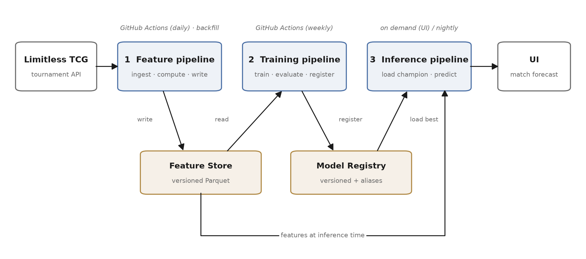

<!--
README requirements (Repository Guide, "By MS4"):
  prediction · FTI diagram · clone-and-run steps · live URL · video link
Video link goes at the top. Every TODO must be gone by 2027-01-10.
-->

# optcg-match-forecast

> Predicts the winner of individual swiss-round matches in competitive One Piece TCG tournaments,
> from the two submitted decklists and each player's prior tournament history.

<!-- MS4: unlisted YouTube / SWITCHtube link here. No video files in the repo. -->
**Live system:** _TODO (MS4)_ · **Video (3 min):** _TODO (MS4)_

Semester project for **I.BA_MLOPS** (MLOps), BSc Artificial Intelligence & Machine Learning,
Hochschule Luzern — HS26.

---

**Live:** <https://optcg-forecast-508975903855.europe-west6.run.app> — no sign-in, scales to zero.
`/version` says which model is answering; `/health` says whether one is loaded at all.

## What it predicts

Given two registered decklists and both pilots' results at strictly earlier events, the system
returns **P(player 1 wins)** for that match. It is served on demand through a UI, and scored
nightly against every match that resolved since the previous run.

The provider lists a tournament only **after it finishes** (verified: the newest event in the live
index is a day old), so there is no in-progress feed to predict against in real time. The honest
architecture is therefore on-demand serving plus nightly scoring — not live in-tournament
inference. The label still arrives on its own, with no manual annotation anywhere in the loop.

**Why this is hard, and why it is interesting:** strong players pick strong decks, so a naive
archetype win rate credits the *deck* for the *pilot*. Separating the two is the modelling
question, and measuring which one carries the signal is the answer.

Pooled over six held-out 28-day windows — 12,574 out-of-time matches, 80 events:

| features | Brier | accuracy |
|---|---|---|
| all 13 | **0.2314** | 61.0% |
| player history only (2 features) | 0.2366 | 59.3% |
| everything **except** player history | 0.2441 | 56.4% |
| matchup cell alone | 0.2452 | 55.6% |

**Player history is the signal**, and it is not close: removing it costs 0.0127 Brier, with a
paired event-clustered interval of [−0.0146, −0.0109] that is nowhere near zero, and it loses in
all six windows. Two player features alone beat the other eleven combined.

An earlier version of this file claimed the opposite — that player strength "contributes almost
nothing" and the signal lived in matchup cells. That was measured on a five-month corpus with a
bug that let events share a date leak into each other, and it was wrong. The correction matters
more than the number, because it changes the product: see below.

**Two questions, one model.** The model is asked one of two things, and keeping them apart is
the point:

- **The deck question** — both pilots set to average: *how does this deck pairing go between
  evenly matched players?* This is what the project is about, and what a deck-builder wants.
- **The match question** — with both players' Limitless handles: *who wins this specific game?*

| | Brier | accuracy |
|---|---|---|
| match question (decks + pilots) | 0.2309 | 61.7% |
| **deck question** (pilots neutral) | **0.2439** | 56.6% |
| plain matchup lookup | 0.2447 | 59.5% |
| coin flip | 0.2500 | 50% |

The deck answer beats the lookup by 0.0008 Brier, 95% CI [−0.0016, −0.0001] — small, real, and
enforced as its own promotion check so the pilot terms can never carry the model past the
baseline while the card signal contributes nothing.

**The pilot terms are not a correction to the deck estimate.** I assumed they were — that they
controlled for "strong players pick strong decks" and cleaned up the matchup rate. Measured on
evenly matched pilots, a model trained with them and served pilot-neutral scores 0.2432, and a
model that never saw them scores 0.2432. Identical. They are an independent skill term sitting
alongside the card signal, which is why the two questions are labelled separately rather than
blended into one headline number.

Skill itself is real: split-half correlation of a player's win rate is +0.40 at 20 matches,
+0.68 at 80, against +0.04 for shuffled outcomes. But it is skill, not card intelligence, and
most of the gap between 0.2439 and 0.2309 is a rating system rather than anything about cards.
Worth knowing that the same signal does *not* transfer to placings: of 702 players who ever
finished top-5, only 26.4% did it twice.

**Handles are optional.** Anyone can ask the deck question. Supplying handles adds the pilot
term and says so.

**The label is not derivable from the features.** It is the outcome of a game between two humans.
The API's first-listed player wins 50.2% of 68,320 decided swiss matches, a Wilson CI that spans
50%, so which slot a player occupies in the payload is not distinguishable from a coin flip and
carries no free signal. (That slot is *not* the player who goes first: turn order is decided at
the table and the API does not record it.)

**Success criterion**, enforced in code as seven named checks that each log PASS or FAIL —
see `contract()` in [`training/run.py`](src/optcg_forecast/training/run.py). Pooled **Brier ≤
0.2490** against the coin-flip 0.2500, over ≥ 6 held-out 28-day windows and ≥ 8,000 matches;
beating the matchup baseline on a block held back before any model was fitted; the 95%
event-cluster bootstrap CI on the skill excluding zero; and **expected calibration error ≤ 3 pp**
with no bucket more than 3σ from its predicted rate.

That last one was originally written as "gaps ≤ 3 pp in every bucket", which is a *maximum* over
buckets and so grows with how many buckets qualify. Simulated on this project's own predictions,
a perfectly calibrated model breaches it 74% of the time. It was measuring bucket count, not
calibration, and it was replaced rather than relaxed.

**Current champion (`v1`, promoted 2026-09-20).** All seven checks pass. On the pooled windows:
Brier **0.2309**, accuracy **61.7%**, ECE **1.39%**. On the 2,454-match gate block held back
before any model was fitted, so nothing was selected against it: Brier **0.2371**, accuracy
**59.1%**, event-cluster skill CI **[+0.0076, +0.0202]**, against **0.2467** for the matchup
lookup on the same block.

Both numbers are on the card, because the 0.006 between them is the cost of choosing a winner
from five candidates, and it is only visible if both are kept.

## Data

| | |
|---|---|
| Source | Limitless TCG tournament API (`play.limitlesstcg.com/api`) — keyless, community-run |
| Corpus (2024-09-07 to 2026-09-17) | 277 events · 25,206 entrants · **23,733 with full 50-card decklists** (94.2%) |
| Usable matches | **68,320** decided swiss matches from 252 events |
| Concentration | largest organiser is 34.0% of matches (61.4% of events) — down from 80.2% before the two-year backfill |
| Leaders seen | 133 distinct |
| Update | event-driven; new events are immutable once finished, so re-fetch by id is safe |

Ingest is deliberately polite: finished events are cached permanently because they never change,
and the request budget is throttled well inside the documented limit.

## Leakage

The API returns each entrant's decklist **directly alongside the event's own outcome**:

```jsonc
{ "player": "...", "decklist": {...}, "deck": {...},   // known before play — features
  "placing": 12, "record": {...}, "drop": null }       // outcomes OF THIS EVENT — never features
```

Two traps, both handled at the ingest boundary in
[`features/ingest.py`](src/optcg_forecast/features/ingest.py):

1. **Post-hoc fields.** `placing`, `record` and `drop` are stripped *physically* before anything
   downstream sees them — not filtered at training time, which would leave the footgun loaded for
   the next caller. `assert_no_leakage()` fails the pipeline if one ever survives.

2. **Selection on the outcome.** Players who drop out mid-event are **kept**. Dropping out is
   itself an outcome, and droppers win far fewer matches than finishers, so the obvious
   `WHERE placing IS NOT NULL` would condition the population on *finishing* and delete most of
   the true negatives. Measured on the backfill: **10,027 of 25,206 entrants (39.8%) dropped**, and
   some of them still received a placing — so `drop IS NOT NULL` is the correct test, not
   `placing IS NULL`.

3. **Top-cut brackets mislabelled as swiss.** Two events are pure single-elimination brackets
   whose rows all carry `phase: 1`. The `match` field (`"T32-16"`) is the reliable marker, so a row
   carrying one is excluded regardless of its phase — 62 matches that would otherwise have been
   counted as swiss.

Splits are **out of time**, by event date, with events as the clustering unit for bootstrap
intervals. Matches from one event never straddle the split.

## Architecture



Three decoupled pipelines — they never call each other, only the feature store and the registry.

| | Pipeline | Trigger | Reads | Writes |
|---|---|---|---|---|
| 1 | **Feature** | GitHub Actions, daily + on-demand backfill | Limitless API | landing zone, then the feature store |
| 2 | **Training** | GitHub Actions, weekly | feature store | model registry (on promotion only) |
| 3 | **Inference** | on demand (UI) + nightly scoring | model registry (mounted from GCS) | predictions / UI, one JSON log line each |

Regenerate the diagram after any stack change:

```bash
./scripts/build_diagram.sh
```

## Stack

| Concern | Choice | Why |
|---|---|---|
| Feature store | versioned Parquet, partitioned by month | point-in-time correctness is enforced in the compute pass — rows are emitted from state as it stood before their *date*, and only then does the day's results fold in. Writes are idempotent at event level, and a rebuild replaces the store rather than merging into it |
| Model registry | local, immutable versions + movable aliases | promotion moves the `champion` alias rather than redeploying, which makes rollback the same operation backwards. Hopsworks was the original plan; the discipline is what is graded and what must survive a migration, so it was built directly |
| Experiment tracking | Weights & Biases | hosted run tracking, so there is no MLflow server to operate for a project this size |
| Orchestration | GitHub Actions | scheduled pipelines live beside the code, and the runner stays the ingest edge rather than a cloud IP range |
| Serving | Google Cloud Run | container deploy, scales to zero between events |
| Storage | GitHub Actions cache today, Google Cloud Storage next | the landing zone is the one durable artefact — immutable event payloads, from which the feature store is always rebuilt. The cache is honestly interim; see `notes/gcp_setup.md` |

**Stretch, explicitly optional:** drift monitoring on decklist composition and calibration
dashboards. Core FTI ships first.

## Clone and run

```bash
git clone https://github.com/kianakiser/optcg-match-forecast.git
cd optcg-match-forecast

uv sync                      # exact versions from uv.lock
cp .env.example .env         # then fill it in — see the table below

uv run python -m optcg_forecast.features.run                    # ingest, then rebuild features
uv run python -m optcg_forecast.features.run --pages 5          # same path, walking back further
uv run python -m optcg_forecast.features.materialise            # rebuild features, no API calls
uv run python -m optcg_forecast.training.run                    # train, evaluate, maybe promote
uv run --extra serve python -m optcg_forecast.inference.serve   # serve on http://localhost:8080
```

Backfill runs through the **same** feature pipeline as live ingest — one code path, so a repaired
gap and a fresh event produce identical features.

With Docker:

```bash
docker build -t optcg-match-forecast .
docker run --rm --env-file .env -p 8080:8080 optcg-match-forecast
```

### Environment variables

Names only — see [`.env.example`](.env.example). Never commit `.env`; the same names must exist as
GitHub Actions secrets for the scheduled pipelines.

| Variable | What it is |
|---|---|
| `SOURCE_API_BASE_URL` / `SOURCE_API_KEY` | tournament API endpoint and key, if one is issued |
| `HOPSWORKS_API_KEY` / `HOPSWORKS_PROJECT` | feature store access |
| `WANDB_API_KEY` | experiment tracking |
| `GCP_PROJECT_ID` / `GCS_BUCKET` / `GCP_REGION` | serving and raw-payload storage |

## Tests

```bash
uv run pytest        # includes repo-hygiene checks that enforce the course rules
uv run ruff check .
```

The hygiene suite fails the build on the course's own rules: no `.env` tracked, no data or model
artifacts in git, no `mlruns/`, no secret patterns, no pipeline importing from a notebook.

## Layout

```
├── src/optcg_forecast/
│   ├── features/     ingest boundary, feature computation, backfill
│   ├── training/     train, evaluate out-of-time, register
│   ├── inference/    load champion, predict, serve
│   └── common/       config and the single source of feature definitions
├── docs/             proposal.pdf, ms*_summary.pdf, architecture diagram
├── tests/            unit tests, run in CI
├── scripts/          diagram generation
└── .github/workflows/  CI + scheduled pipelines
```

Feature definitions live in exactly one place under `common/`, used by both training and
inference. That is what keeps training–serving skew out.

## Milestones

| | Due | Status |
|---|---|---|
| MS1 Proposal | 2026-10-01 | ☐ |
| MS2 Feature pipeline | 2026-11-05 | ☐ |
| MS3 Training pipeline | 2026-12-03 | ☐ |
| MS4 Live system | 2027-01-10 | ☐ |

## Acknowledgements

Tournament data from the community-run [Limitless TCG](https://play.limitlesstcg.com) platform.
Non-commercial student project; One Piece Card Game is a trademark of its respective owner.
